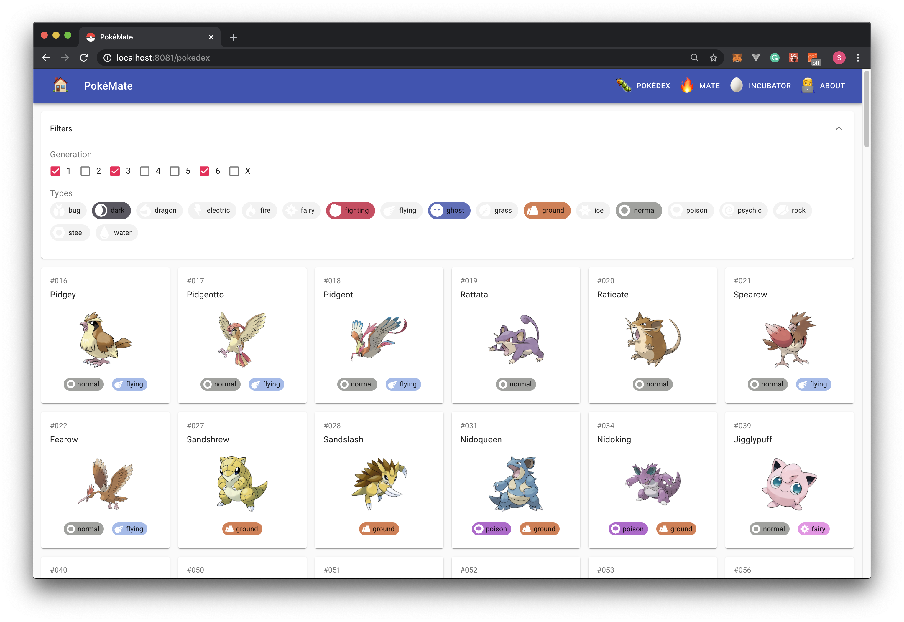
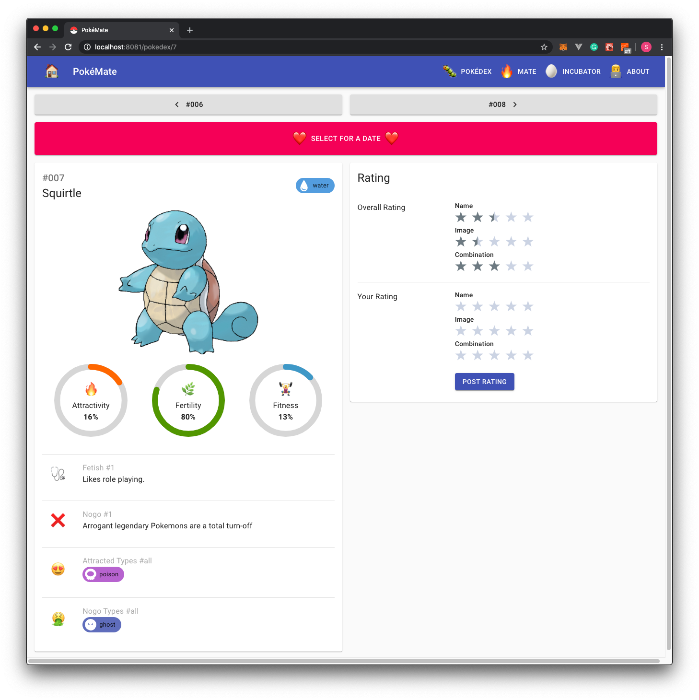
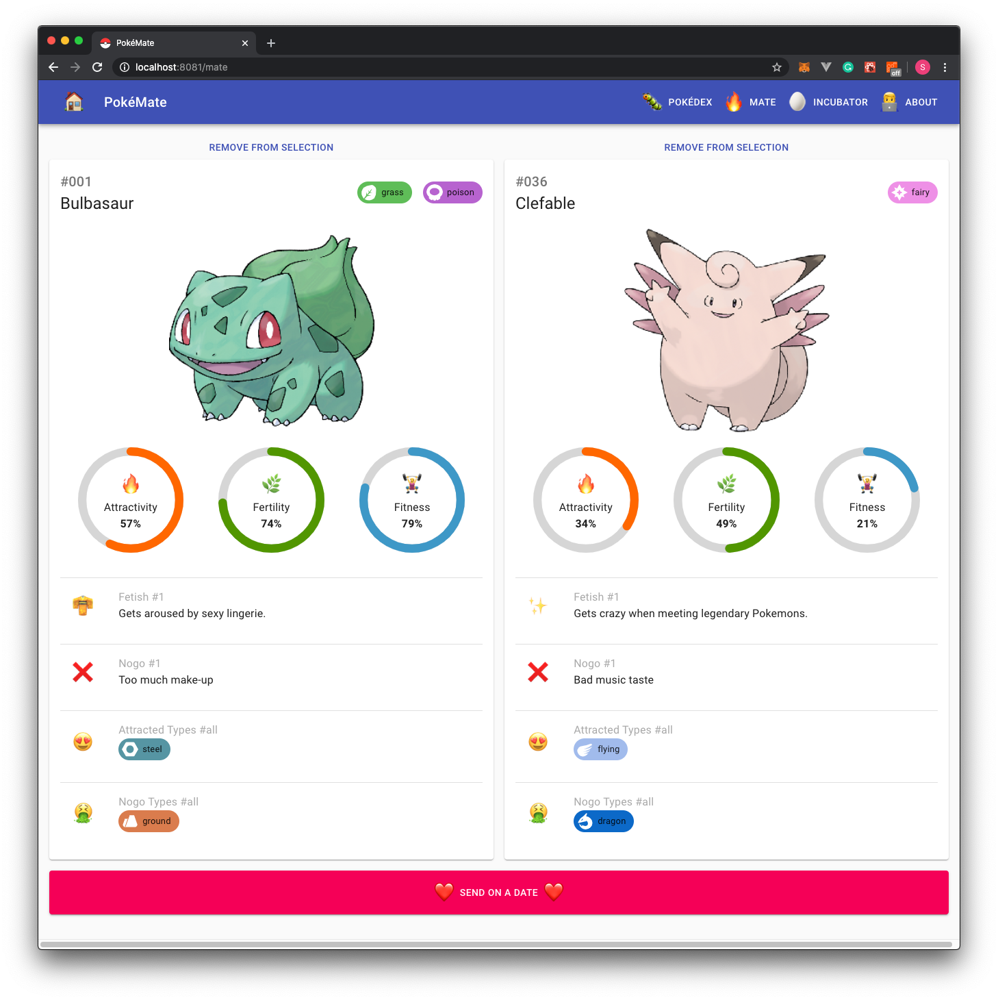
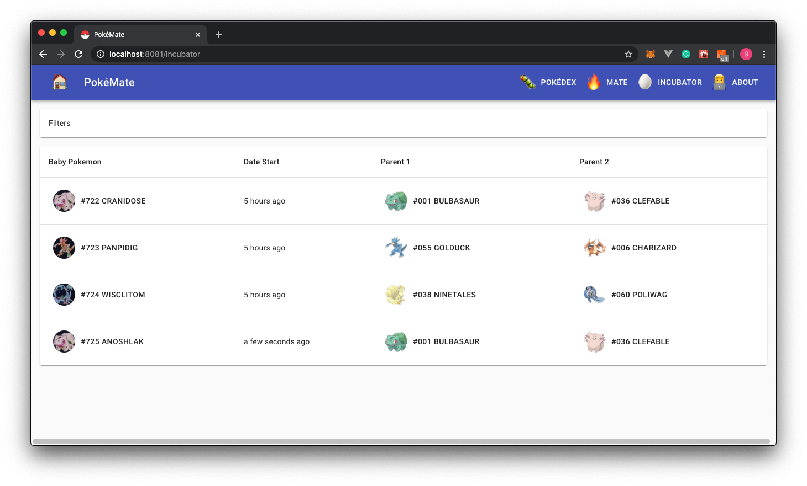
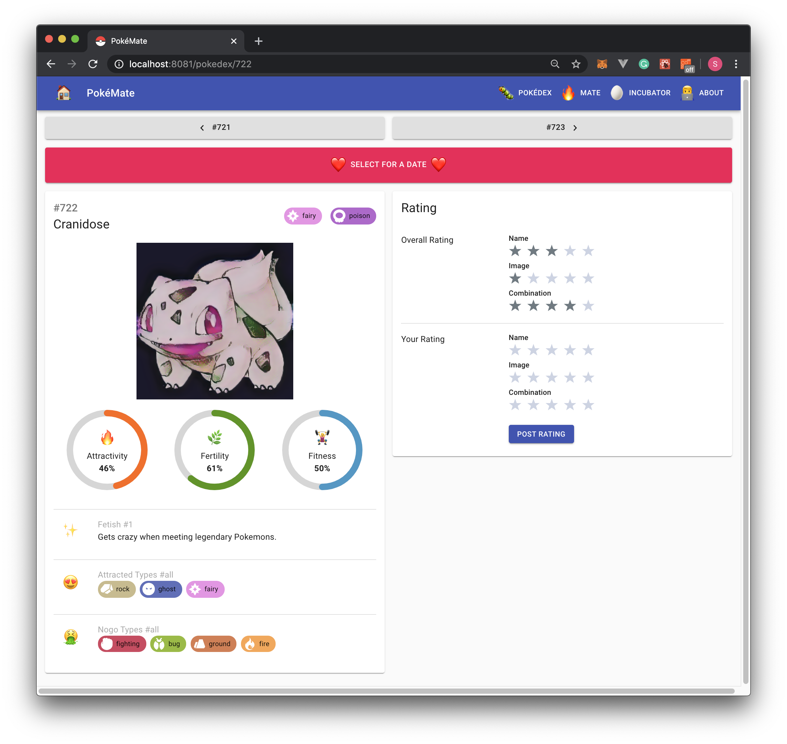

# PokeMate Frontend Application

## Installation

```bash
npm install
npm start
```

## Demo

### Pokedex 🐛

The Pokedex can be filtered with the the generation and the type. Newly generated Pokemons are of generation X.



The following parameters influence the chances of a successful mating date:

- Attractivity
- Fertility
- Fitness
- Attracted Types
- No-Go Types

### Pokemon Details 🐛

The fetishes section is used as an entertainment parameter and is currently not evaluated in the dating success rate.



### Mating 🔥



### Incubator 🥚🐣🐓




### Mobile

The application was designed in a way that it scales properly for mobile too.

<p float="middle">
   
  
  
</p>
